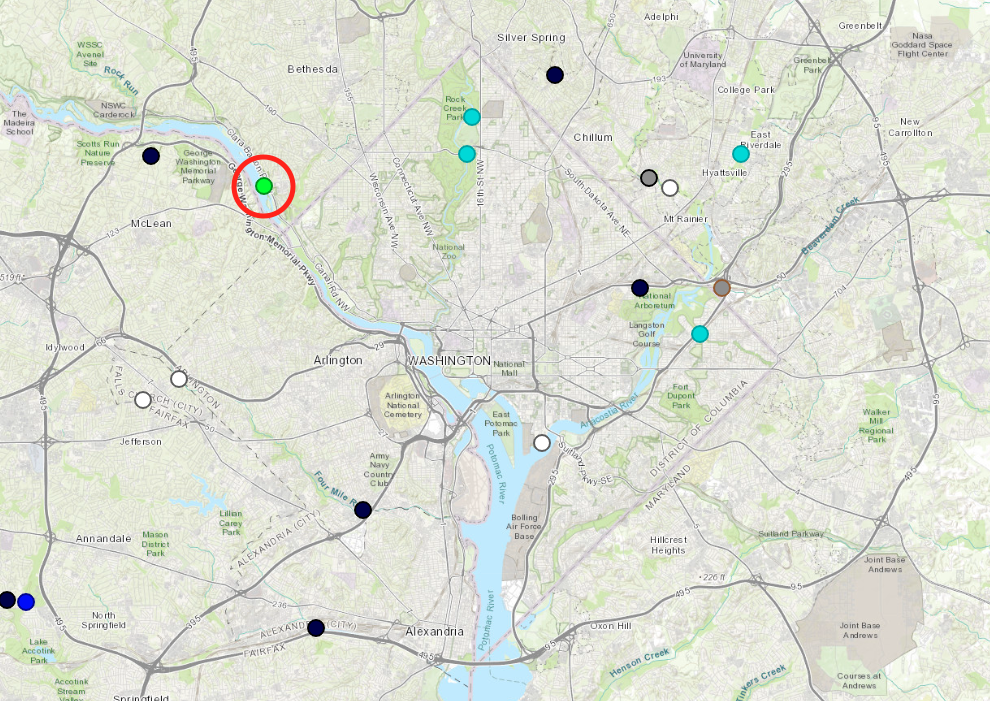

```{r setup, include=FALSE}
knitr::opts_chunk$set(
  echo = FALSE, 
  prompt = FALSE,
  tidy = FALSE, 
  comment = NA,
  message = FALSE, 
  warning = FALSE,
  fig.align = 'center'
)
```

## Description of Data

- Downloaded data from the United States Geological Survey (USGS) database as a .txt file

- Daily data of the Potomac River from the Little Falls Pump Station (USGS site 01646500) for every day of 2023

- Data was opened and cleaned in Excel 

- The site is located 1 mi upstream of DC

- Water parameters include: temperature, pH, turbidity, dissolved oxygen, nitrogen, discharge

- USGS gives its data a grade for approved, provisional, and estimated. Assumed data is approved for this analysis. 

## Site Location
```{r, fig.align = 'center', out.width = "60%"}

```

## Discharge
- Discharge (Q) is a measure of water flow. Common units are cubic feet per second (cfs) and gallons per minute (gpm)
```{r, echo = F, eval = T}
# Load packages
library(tidyverse)
library(patchwork)
library(readxl)
library(ggplot2)
library(knitr)

# Load data
df = read_excel('cleaned_data.xlsm')

# Change date format
df =
  df |>
  mutate(Date = as_date(Date)) # Changes variable format to date format  

# Analysis Slide 1: Daily Potomac River Flow
t1 = as.array(summary(df$Discharge))
kable(t1)
```

```{r, fig.align = 'center', out.width = "50%"}
Q = ggplot(df, aes(x = Date, y = Discharge)) + # Plots discharge vs. time
  geom_line(color = 'dodgerblue2') + # Adds line
  geom_point(color = 'dodgerblue2', size = 1.5) + # Add points
  labs( # Add labels
  x = 'Time', 
  y = 'Discharge (cfs)',
  title = 'Daily Potomac River Flow (2023)'
  ) +
  scale_y_continuous( # Adds limits, breaks, labels, and removes white space between x-axis and 0
    limits = c(0, 35000),
    breaks = c(0, 5000, 10000, 15000, 20000, 25000, 30000, 35000),
    labels = c(0, "5,000", "10,000", "15,000", "20,000", "25,000", "30,000", "35,000"),
    expand = c(0, 0)) +
  scale_x_date(date_labels = "%b", date_breaks = "1 month") + # Edits format of x-axis values
  theme_bw() + # Adds a black and white theme
  theme( # Adds a custom theme to the plot
    legend.position = 'none',
    plot.title = element_text(hjust = 0.5),
    panel.grid.minor.x = element_blank(),
    panel.grid.minor.y = element_blank()
  )

Q
```

##  Dissolved Oxygen and Nitrogen

- Dissolved oxygen (DO) is a measure of how much dissolved oxygen is in water. Units are mg/L as DO.

- Nitrogen (N) is a measure of the amount of dissolved nitrogen in water. Units are mg/L as N. 

```{r, fig.align='center', out.width = "50%"}
# Analysis Slide 2: Dissolved Oxygen and Nitrogen Concentrations
O = ggplot(df, aes(x = Date, y = DO_Mean)) + # Plots oxygen vs. time
  geom_line(color = 'forestgreen') + # Adds line
  geom_point(color = 'forestgreen', size = 1.5) + # Adds points
  labs( # Adds labels
    x = 'Time', 
    y = 'DO (mg/L)'
  ) +
  scale_y_continuous( # Adds limits, breaks, labels, and removes white space between x-axis and 0
    limits = c(0, 16),
    breaks = c(0, 2, 4, 6, 8, 10, 12, 14, 16),
    labels = c(0, 2, 4, 6, 8, 10, 12, 14, 16),
    expand = c(0, 0)) +
  scale_x_date(date_labels = "%b") + # Edits format of x-axis values
  theme_bw(base_size = 14) + # Adds a black and white theme
  theme( # Adds a custom theme to the plot
    legend.position = 'none',
    axis.title.y = element_text(size = 12),
    panel.grid.minor.x = element_blank(),
    panel.grid.major.x = element_blank(),
    panel.grid.minor.y = element_blank(),
    panel.border = element_blank()
  )

N = ggplot(df, aes(x = Date, y = NO3_NO2_Mean)) + # Plots nitrogen vs. time
  geom_line(color = 'firebrick2') + # Adds line
  geom_point(color = 'firebrick2', size = 1.5) + # Adds points
  labs( # Add labels
    x = 'Time', 
    y = 'NO3 + NO2 (mg/L)'
  ) +
  scale_y_continuous( # Adds limits, breaks, labels, and removes white space between x-axis and 0
    limits = c(0, 3.0),
    breaks = c(0, 0.5, 1, 1.5, 2, 2.5, 3),
    labels = c(0.0, 0.5, "1.0", 1.5, "2.0", 2.5, "3.0"),
    expand = c(0, 0)) +
  scale_x_date(date_labels = "%b") + # Edits format of x-axis values
  theme_bw(base_size = 14) + # Adds a black and white theme
  theme( # Adds a custom theme to the plot
    legend.position = 'none',
    axis.title.y = element_text(size = 12),
    panel.grid.minor.x = element_blank(),
    panel.grid.major.x = element_blank(),
    panel.grid.minor.y = element_blank(),
    panel.border = element_blank()
  )

p1 = # Creates patchwork plot 
  O + N + plot_annotation(title = 'Daily Potomac River Dissolved Oxygen & Nitrogen (2023)') &
  theme(plot.title = element_text(hjust = 0.5, size = 14)) # Adds plot title

p1
```